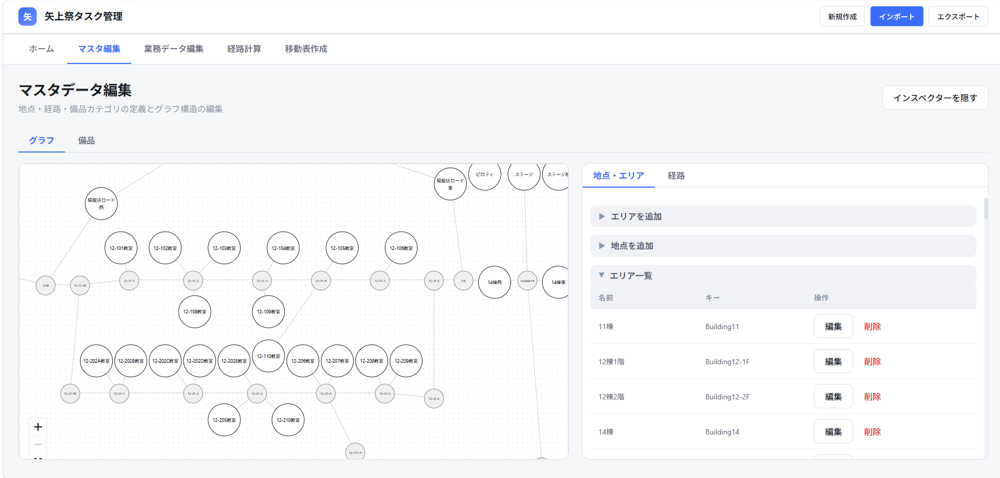
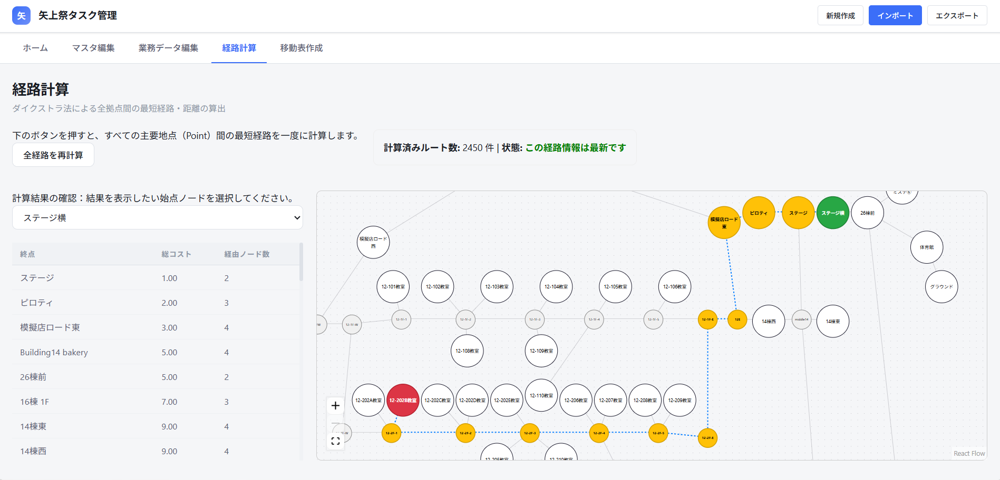
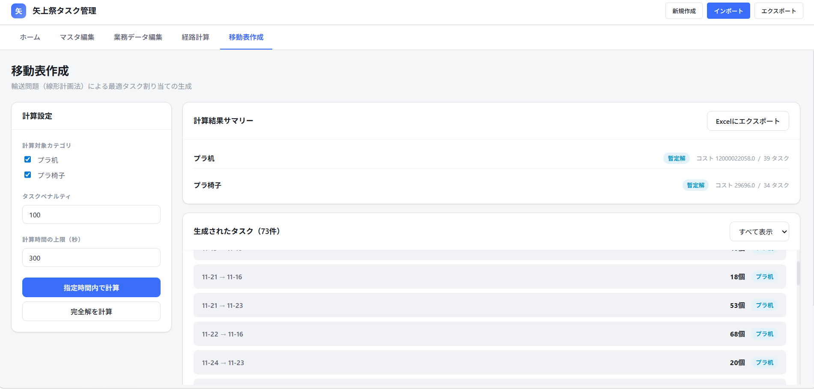

# タスク管理アプリ

矢上祭の準備日・片付け日に発生する机椅子移動タスクを，キャンパスグラフの編集から経路計算，移動表の生成まで一気通貫で支援するシステム．

## 1. 背景と課題

総務局が扱う机椅子の移動は，拠点数・経路数・備品数が多くなるほど手作業での管理が難しくなる．
具体的に以下のような問題が存在した．

- 移動表を作成するのは無数の組み合わせから正解を選ぶ作業であり，勘と経験だよりの職人技である
- 人間だと動的な変化に対応するのが難しい
- タスクをデータとして扱うことができず，今後のフローに活用出来ない

このプロジェクトでは，上記をデータ形式の定義，フロントエンドとバックエンドに分けて実装した．

## 2. デモリンクと画面イメージ

Frontend URL: https://takumi0402.github.io/MovingTasks/

Backend URL: https://movingtasks-pythonapi.onrender.com/

サンプルデータ (mapdata_sample.zip): [mapdata_sample.zip](mapdata_sample.zip)
（※フロント画面右上のインポートボタンからインポートして使用可）

### キャンパス編集



### 経路計算・表示



### 移動表生成



## 3. 主要機能

### フロントエンド

- 大学キャンパスのグラフ編集GUI
- 備品編集GUI
- 業務データ編集GUI
- 経路計算・確認GUI
- バックエンドソルバーとの通信GUI

### バックエンド

- 最適化計算ソルバー

### データ形式

タスクの定義とキャンパスマップのデータ形式を以下に示す．

```text
(1 task) = 地点 S_i から地点 D_j へ備品 O_k を N 個
```

地点Sは供給地，地点Dは需要地，備品Oは備品種別，Nは個数を表す．

他．キャンパスの双方向グラフ化等

## 4. 実装における課題と解決策

### グラフ編集機能のUI

- 総務局員がキャンパス構造を編集できる機能が必要
- 解決策: 「draw.io」のUIを参考に，React Flowを用いたグラフ編集ページを開発した．

### 混合整数計画問題(MIP)ソルバーについて

- 講義知識をもとに独自にMIPソルバー開発に試みるも双対問題が複雑で断念
- 解決策: 既存ライブラリ（PuLP）を使用．実装で得た知識が内部挙動の理解に活きた．

### 計算量の爆発（NP困難）への対処

- 「タスクペナルティ」制約の追加により、計算時間が指数関数的に増大
- 解決策: 厳密解ではなく，時間制限を設けて暫定解を算出するオプションを追加した．

## 5. 技術スタック

- Frontend: React
- Backend: FastAPI
- Data format: XML

## 6. アルゴリズム概要

### 最短経路導出

グラフの各辺が非負であることを前提に，ダイクストラ法で全拠点間の最短経路を求めている．

### タスク最適化

移動計画は，混合整数計画問題として扱い，分枝限定法と線形緩和を使って解いている（バックエンド）．

## 7. 開発・デバッグ

### ローカル起動

- フロントエンド: `react-app/` で `npm run dev`
- バックエンド: `python-api/` で `uvicorn main:app --reload`

### デプロイ

- フロントエンド: `react-app/` で `npm run deploy`
- バックエンド: Render 上で手動デプロイ

## 8. 更新履歴

- 2025/08/02: リポジトリ立ち上げ
